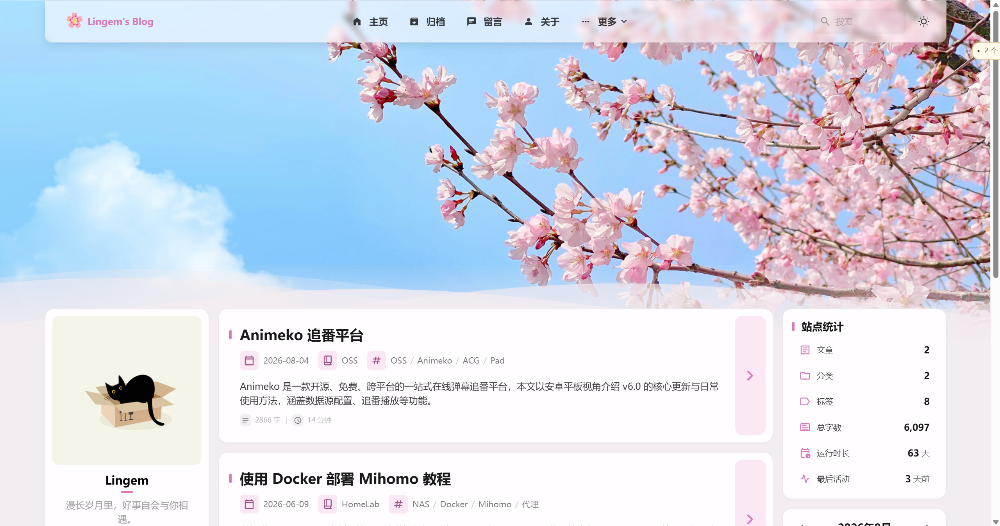

# Lingem's Blog

> じゅんあい ばんざい

---

## 关于本站

这里是 Lingem 的个人博客。主要记录 HomeLab 折腾经验、ACGN 相关内容，以及自学日语的点滴。

我不追求成为什么技术博主，只是把自己踩过的坑、学到的东西写下来。一方面方便自己以后回顾，另一方面也许能帮到和我一样在摸索的人。

### 内容方向

- 🖥️ **HomeLab** — NAS、Docker、自托管服务折腾记录
- 🎬 **ACGN** — 追番笔记、漫画推荐、游戏心得
- 🇯🇵 **日语学习** — 自学路上的方法与资源
- 📦 **开源折腾** — 折腾过程中的小工具与脚本

<table width="100%" align="center">
  <tr>
    <td colspan="3" align="center">
      
       博客首页</td>
    </td>
  </tr>
</table>

---

## 致谢

本站使用的是 [Firefly](https://github.com/CuteLeaf/Firefly) 主题搭建，非常感谢 [CuteLeaf](https://github.com/CuteLeaf) 的开源项目。

Firefly 最初 Fork 自 [saicaca/fuwari](https://github.com/saicaca/fuwari)，感谢 [saicaca](https://github.com/saicaca) 的贡献。

---

## 许可

本项目遵循 [MIT License](./LICENSE)，继承自上游项目。

原始版权声明：
- Copyright (c) 2024 [saicaca](https://github.com/saicaca) — [fuwari](https://github.com/saicaca/fuwari)
- Copyright (c) 2025 [CuteLeaf](https://github.com/CuteLeaf) — [Firefly](https://github.com/CuteLeaf/Firefly)
