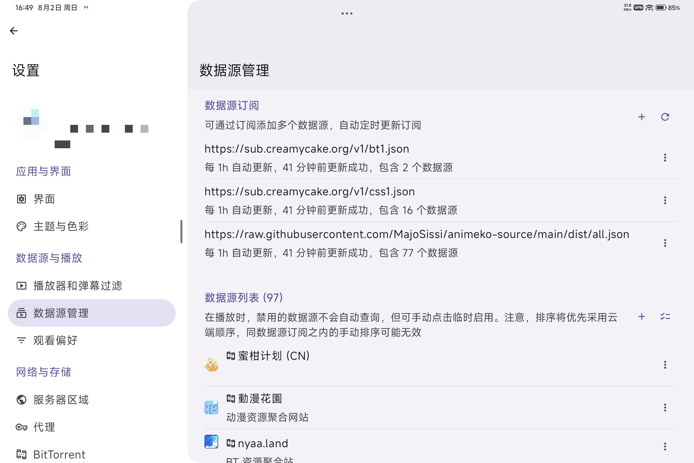

> [!WARNING] 本文具有时效性
> 本文基于 **Animeko v6.0.0 正式版**编写，记录的是该版本发布时的功能状态与操作流程。Animeko 是一个活跃迭代的开源项目，后续版本可能会有部分变化。如果你使用的是更新或更旧的版本，本文内容可能与实际操作存在差异，届时请以应用内实际表现为准。

Animeko 是我正在高频使用的追番软件，虽然我认为它目前还有一些缺点，例如没有账号注销功能，部分新番更新时间错误，数据源有广告等问题，但我非常喜欢在我的平板电脑上使用它，它对平板类大屏设备的适配做得很好，因此相比于它的手机端，我更喜欢在平板上使用它。最近，它更新了 v6.0 正式版，借此机会写一篇文章，主要介绍该软件在平板电脑上的使用。

[grid]
.jpg)
.jpg)
.jpg)
[/grid]

[grid]
.jpg)
.jpg)
.jpg)
[/grid]

[grid]
.jpg)
.jpg)
.jpg)
[/grid]

## 项目简介

**Animeko**（简称 Ani）是一个开源、免费、跨平台的一站式弹幕追番软件，集找番、追番、看番于一体。支持 Android（手机 / 平板）、iOS（需自签）、Windows、macOS、Linux 五大平台，深度集成 Bangumi 云同步、多数据源聚合、弹幕互动、离线缓存、全自动 BT 等核心功能。

::github{repo="open-ani/animeko"}

| 功能 | 说明 |
|------|------|
| 多数据源聚合 | BT 源 + 在线源自动选择，兼顾质量与速度 |
| Bangumi 云同步 | 观看进度、追番清单云端同步 |
| 弹幕系统 | 弹弹play + Animeko 公益弹幕服务器 + 多平台弹幕聚合 |
| BT 边下边播 | 基于 libtorrent 的内置引擎，无需额外下载客户端 |
| 离线缓存 | 全部数据源均支持缓存下载，无网络也能看 |
| 完全开源 | AGPLv3 协议，代码托管于 GitHub |

> [!NOTE] 数据来源
> Animeko 本身不存储任何视频数据，所有视频来自网络公开数据源，包括 [BT 源和在线源](#bt-源与在线源)。

## v6.0 核心更新

以下是我个人认为本次更新中比较重要的功能，完整更新列表请到[文章末尾](#v600-完整更新列表)查看。

- **全新条目详情页**：重新设计的番剧详情页，新增角色和声优信息查看及关联条目浏览
- **番剧详情页动态渐变背景**：开启后可以看到渐变背景，但会增加发热和耗电
- **移动端交互优化**：快进上滑取消、手势全屏切换
- **进度条画面预览**：拖动进度条时预览画面帧，可在设置开关
- **HLS 贴片广告过滤**：实验性功能，自动过滤视频源广告
- **一起看**：与好友同步观看番剧，共享进度，异地追番体验

> [!WARNING] 进度条画面预览
> 本次更新最让我惊喜的就是全新条目详情页，现在的新版详情页非常好看，比以前的页面好看太多了！但进度条画面预览功能我不清楚是不是我的问题，在平板上并没有看到预览画面。

## 初次使用

下载与安装不过多介绍，请前往[官网](https://myani.org/)或 [GitHub 仓库](https://github.com/open-ani/animeko/)进行下载并安装，安装完成后直接打开应用。

Animeko 支持**游客模式**——不登录也能使用搜索、播放、弹幕等大部分功能，不想折腾的话现在就可以去享受看番了，但我个人建议还是注册一个吧，功能会丰富不少。

### 登录 Bangumi

> [!TIP] 什么是 Bangumi
> Bangumi 是由 Sai 于桂林发起的 ACG 分享与交流项目，致力于让阿宅们在欣赏ACG作品之余拥有一个轻松便捷独特的交流与沟通环境。

虽然现在 Animeko 已支持邮箱注册账号，可跨设备同步收藏，但我强烈建议通过 Bangumi 进行注册和登录，因为通过此方式登录后，你在 Animeko 上的番剧观看记录可以同步至 Bangumi 网站中，并且可以对番剧进行打分，与其他人友好讨论等其他丰富功能。注册登录方式很简单：

1. 打开 Animeko 点击应用右上角「登录」→ 点击「登录/注册」
2. 跳转至 Bangumi 官网注册 / 登录
3. 授权后自动返回 Animeko

注册登录成功后，进入设置，点击自己的头像就能看到自己的账号信息了。

> [!IMPORTANT] 账户激活服务不可用
> 这是 Bangumi 的已知问题。请尝试在输入完激活码后，手动删除最后几个字符，然后重新手动输入。

> [!IMPORTANT] 已停止访问该网页
> 这通常发生在内置浏览器中。请下载并使用第三方浏览器（例如 Chrome、Via、Firefox），并在系统设置中将其设置为默认浏览器，然后再尝试操作。

### 个性化设置

应用默认设置可能并不适合你，至少不适合我，下面是我修改后的设置项，仅供参考。请注意，设置并不跟随账号，如果需要多设备使用同一套设置，请使用设置备份功能。

[grid]
.jpg)
.jpg)
.jpg)
.jpg)
[/grid]

## 数据源管理

数据源是 Animeko 的核心，它决定了你能搜索到和播放哪些内容。

### BT 源与在线源

**BT 源**基于 BitTorrent P2P 网络，资源质量高、来源广，但速度依赖做种者数量。使用 BT 源时 Animeko 会**自动做种**（上传分享数据），这是 P2P 网络的互助机制。

**在线源**来自其他视频资源网站，即点即播、速度快，但画质损失很大。v6.0 新增的 HLS 广告过滤功能可能在一定程度上过滤在线源的贴片广告。

> [!TIP] 个人习惯
> 我使用 Animeko 是用来追番的，所以我只使用在线源，新番放送后基本就能直接看了。我不会在该应用里使用 BT 源，速度慢，而且我有自己看老番的方式，这是我的使用习惯，具体情况因人而异。

### 添加自定义数据源

Animeko 默认有21个数据源，一般情况下是够用的，如果你觉得太少了，可以添加数据源订阅链接、或者单独添加数据源链接：

1. 进入「设置 → 数据源管理」
2. 找到数据源订阅或数据源列表，点击「+」按钮
3. 粘贴网络公开的数据源链接
4. 点击添加后新线路自动纳入资源调度池

::github{repo="MajoSissi/animeko-source"}

这是一个公开的 Animeko 聚合订阅源/数据源，聚合了多个三方源，订阅其中一个即可。以[这个链接](https://raw.githubusercontent.com/MajoSissi/animeko-source/main/dist/all.json)为例，该订阅源包含了77个数据源，足够日常使用了。

## 享受追番！

至此，应用设置基本完成，可以尽情享受追番的乐趣了！下面简单介绍下播放手势。

### 播放与手势

进入番剧详情页，点击「开始观看」后，Animeko 自动从数据源加载资源。如需手动切换数据源，在播放界面侧边栏点击更换，或顶部栏选择即可。

平板上的常用播放操作：

| 操作 | 方法 |
|------|------|
| 快进 / 快退 | 左右滑动 |
| 取消快进 | v6.0 新增上滑取消 |
| 全屏切换 | 播放页面正中心上下滑动切换 |
| 跳过片头 | 支持 80 / 85 / 90 秒自定义 |
| 视频截图 | v6.0 播放界面新增截图功能 |
| 倍速播放 | 播放界面切换，支持自定义倍速 |

> [!TIP]
> Android 端 v6.0 使用 WSOLA 倍速引擎，倍速播放时提供更好的音质，如遇爆音或音质异常可前往「设置→播放器和弹幕过滤」进行关闭。

## 总结

Animeko 是我目前在平板上追番的主力工具，v6.0 的更新进一步弥补了它在播放体验上的短板。全新详情页让找番选番更加直观，HLS 广告过滤和 Android 多媒体增强则切实改善了日常观看体验。

虽然它还有一些小问题待解决，但作为一个完全开源的项目，它的迭代速度和质量已经令人满意。如果你也在寻找一个简洁、好用、跨平台的追番工具，不妨试试。

最后，感谢 Animeko 的开发团队和所有贡献者，没有他们的努力，就没有这个项目。

## v6.0.0 完整更新列表

### 播放器与播放体验

| 功能 | 平台 | 说明 |
|------|------|------|
| mpv 播放器内核 | Windows / macOS | 硬件解码与渲染，性能飞跃 |
| mpv 扩展至 Win ARM / Linux x64 | Win ARM / Linux | 更多平台享受 mpv 体验 |
| 进度条画面预览 | 全平台 | 拖动进度条时预览画面帧，可在设置开关 |
| 播放统计面板 | 全平台 | 播放页按 `TAB` 键查看码率、解码器等信息 |
| 自定义播放倍速 | 全平台 | 不再限于预设档位，可自定义速度 |
| 手势全屏切换 | 全平台 | 滑动手势进入或退出全屏 |
| HLS 贴片广告过滤 | 全平台 | 实验性功能，自动过滤视频源广告 |
| 验证码自动处理 | 全平台 | 数据源图形验证码自动识别通过 |
| Android 视频截图 | Android | 播放中直接截取画面 |
| Android libass 字幕渲染 | Android | 更高质量的字幕渲染 |
| Android WSOLA 倍速引擎 | Android | 倍速播放时保持音调自然 |
| 跳过片头时长可配置 | 全平台 | 支持 80s / 85s / 90s 自定义 |

### 界面与交互

| 功能 | 平台 | 说明 |
|------|------|------|
| 毛玻璃效果 | Android / iOS | 标题栏和导航栏支持毛玻璃，可在设置开关 |
| 番剧详情页动态渐变背景 | 全平台 | 默认关闭以减少发热和耗电 |
| 全新条目详情页 | 全平台 | 新增角色和声优查看、关联条目浏览 |
| 桌面端窗口置顶 | 桌面端 | 右键窗口拖动区域切换置顶状态 |
| Windows 原生触控输入 | Windows | 触屏设备体验优化 |
| 移动端快进上滑取消 | 移动端 | 更自然的快进交互，上滑即可取消 |

### 数据源与管理

| 功能 | 说明 |
|------|------|
| 数据源批量操作 | 管理页支持多选模式，悬浮批量工具栏 |
| 缓存批量管理 | 支持多选批量管理缓存 |
| 数据源 tier 配置 | 支持为数据源配置优先级层级 |
| 测试结果保留 | 数据源启用/禁用后保留已完成的测试结果 |

### 平台支持

| 功能 | 说明 |
|------|------|
| Windows ARM64 | 新增 WoA (Windows on Arm) 支持 |
| Linux 增量更新 | AppImage 支持增量更新，下载体积更小 |
| Linux 动态取色 | 桌面端支持系统动态取色 |
| Linux SwiftShader 渲染 | 内置浏览器改用 SwiftShader，减少显卡兼容性问题 |

### 重要修复

- **安全修复**：不再在日志中记录 Bangumi 访问令牌
- **代理修复**：修复使用代理时授权请求头不正确的问题
- **macOS 稳定性**：修复 Anitorrent 加载失败、自动更新卡住等问题
- **Linux 稳定性**：修复 JCEF 与 SQLite 冲突、头像上传崩溃、原生库加载不稳定等
- **封面修复**：修复集合列表条目海报不显示的问题