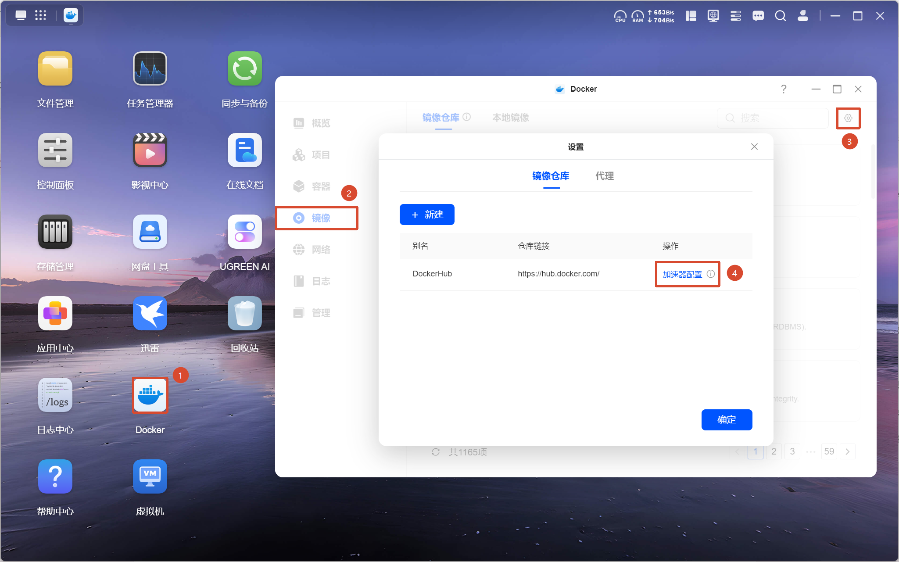
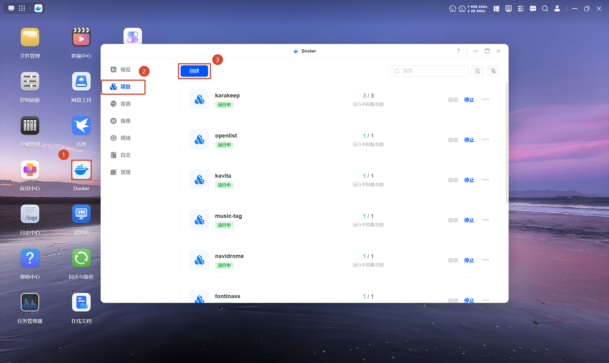
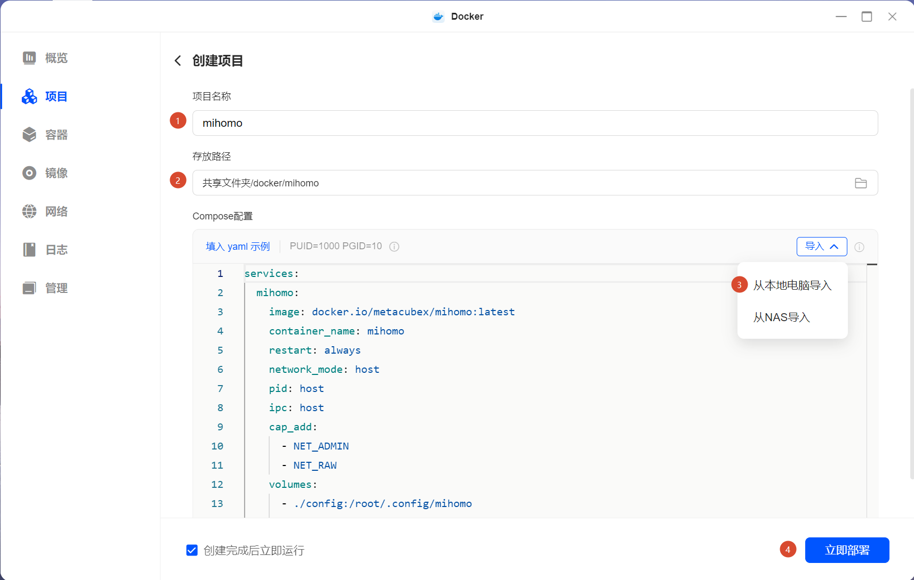
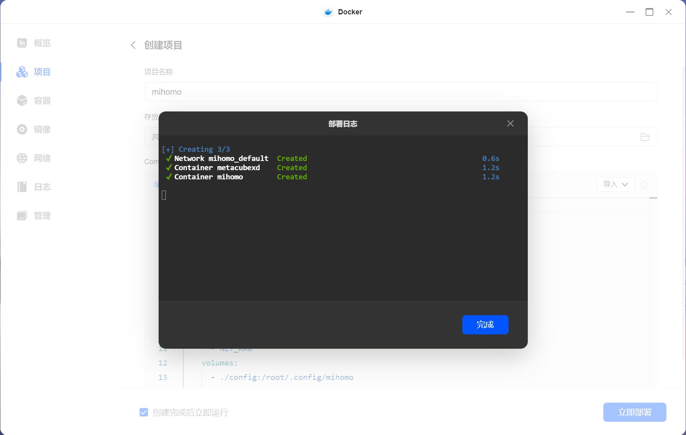
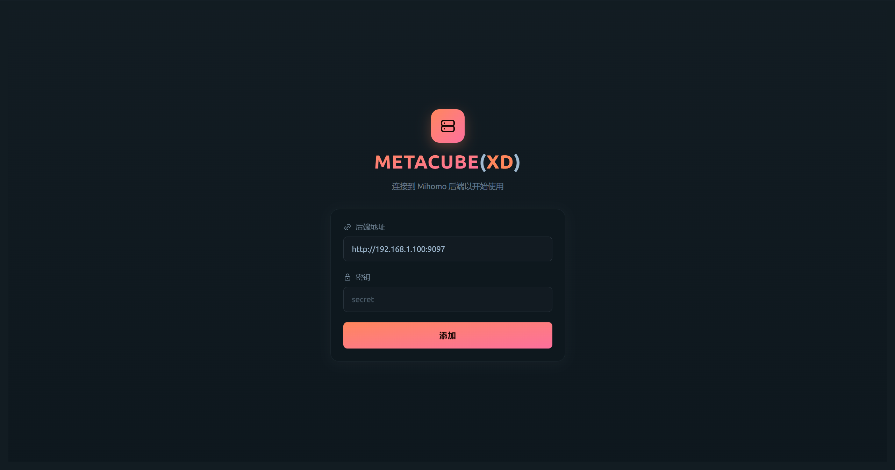
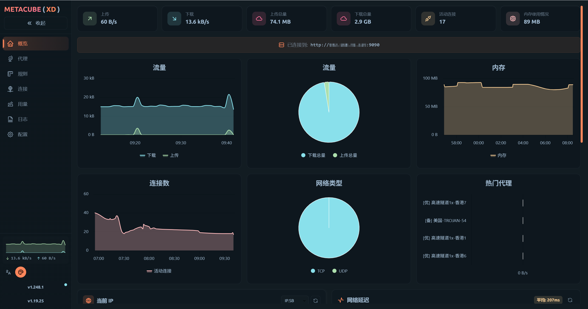
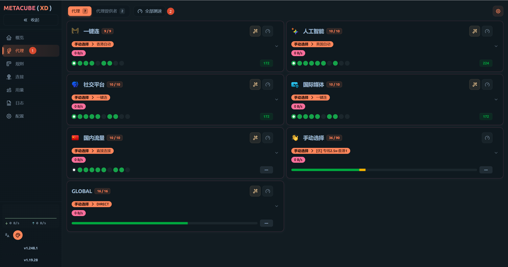

> [!CAUTION] 法律声明
> 根据《中华人民共和国网络安全法》等相关法律法规，代理工具应仅用于合法的网络访问需求（如访问境外学术资源、开发文档等），不得用于访问违法内容或从事任何违法违规活动。请自行确保使用行为符合当地法律法规。

> [!WARNING] 本文具有时效性
> 本文写于 2026 年 6 月，文中使用的配置模板的仓库仍在活跃更新，模板版本、规则集 URL、节点筛选规则等可能随时变动。此外，MetaCubeXD 面板版本、绿联 NAS 系统界面等也可能随时间发生变化。如果你在参照本文操作时发现配置项、界面或链接与文中描述不一致，请以上游仓库的最新版本和实际表现为准。

2023 年中我买了一台 NAS，最初的用途很简单——存资源。动漫、漫画、电影、生活资料等等，一股脑儿往里塞。后来慢慢发现 NAS 的玩法远不止于此，开始折腾各种 Docker 项目，比如 Emby 媒体服务器，但我发现：Emby 刮削元数据需要访问 TMDB、Fanart.tv 等外网服务，而 NAS 默认没有代理能力。

我之前用代理的方式很简单——哪台设备需要，就在上面装客户端，方便快捷，但 NAS 行不通。我曾经想过搭建旁路由，这样家里的设备在不安装客户端的情况下也能够使用代理，一举两得，但最后发现无法达到自己满意的效果，使用旁路由代理的设备访问外网并没有比客户端快，而且有时还不稳定。我知道这基本上是我自己配置不当导致的，但这也说明玩软路由是需要一定门槛的，没有相关知识储备完成这件事非常耗费精力，所以后来我放弃了软路由方案。

那么，我的 NAS 怎么走代理呢？我选择的方案是，把代理跑在 Docker 容器里，通过 docker 部署是非常简单的，反正我只需要其他 docker 容器能走代理即可，它们的流量很小，无需过分考虑速度和稳定性。

> [!TIP] 友情提示
> 如果你希望跟着教程走，最好先通读一遍教程👀再上手。

## 前提条件

本文以我手中的绿联 DX4600-PRO 进行演示，需要：
- NAS 已安装 Docker
- 至少一份可用代理的订阅链接

## 目录结构

请找到你的 docker 文件夹，在其下创建 mihomo 文件夹，再在 mihomo 内创建 config 文件夹。`config.yaml` 和 `docker-compose.yaml` 稍后配置完成后上传。

```text
/vol1/docker/mihomo/
├── config/
│   └── config.yaml
└── docker-compose.yaml
```

- **`/vol1/docker/mihomo/`** — 项目目录，Docker 项目统一放在 docker 目录下，按项目名建子文件夹。
- **`config/config.yaml`** — Mihomo 的核心配置文件，包含端口、订阅、规则、DNS、策略组等设定。
- **`docker-compose.yaml`** — compose 编排文件，定义了 mihomo 和 webui 两个容器的镜像、端口、挂载等配置。

## 编写 Mihomo 配置文件

在电脑上创建一个 `config.yaml` 文件，将下面的配置复制进去，并在 `proxy-providers` 部分中将`优质服务商地址`，`备用服务商地址`这几个字替换为自己的订阅链接，完成后上传到 NAS 上刚创建的 config 文件夹。

> [!TIP]
> 该模板来源于一个精选的配置文件仓库，预设了一主一备两个订阅源。如果只有一个订阅链接，可以考虑该仓库的其他优质模板。虽然可以删除其中一个订阅链接，但我不愿意对原模板进行改动，我也没试过删除后是否会有影响。

::github{repo="HenryChiao/MIHOMO_YAMLS"}

```yaml title="config.yaml" showLineNumbers wrap collapse={1-43} {"填入订阅链接":45-49} {"面板密码":85}
# >>=====================================<<
# ||                                     ||
# ||      ██████╗  ██████╗  ██████╗      ||
# ||     ██╔════╝ ██╔════╝ ██╔════╝      ||
# ||     ███████╗ ███████╗ ███████╗      ||
# ||     ██╔═══██╗██╔═══██╗██╔═══██╗     ||
# ||     ╚██████╔╝╚██████╔╝╚██████╔╝     ||
# ||      ╚═════╝  ╚═════╝  ╚═════╝      ||
# ||                                     ||
# >>=====================================<<
# 名称: OneTouch 一键连
# 地址: https://github.com/666OS/YYDS
# 版本: v26.1.4
# 作者: YYDS666
# 更新: 2026 年 7 月 11 日
# 频道: https://t.me/Pinched666
# 描述: 一键连纯净版

# ==================== 锚点配置 ====================
# 代理提供者模板 - 订阅源基础配置
BaseProvider: &BaseProvider {type: http, interval: 86400, proxy: DIRECT, health-check: {enable: true, url: 'https://www.google.com/generate_204', interval: 300}, filter: '^(?!.*(群|邀请|返利|循环|官网|客服|网站|网址|获取|订阅|流量|到期|机场|下次|版本|官址|备用|过期|已用|联系|邮箱|工单|贩卖|通知|倒卖|防止|国内|地址|频道|无法|说明|使用|提示|特别|访问|支持|教程|关注|更新|作者|加入|USE|USED|TOTAL|EXPIRE|EMAIL|Panel|Channel|Author))'}

# 策略组类型模板 - 定义不同的策略组基础配置
BaseUT: &BaseUT {type: url-test, interval: 200, lazy: true, empty-fallback: REJECT, url: 'https://www.google.com/generate_204', hidden: true}
BaseFB: &BaseFB {type: fallback, interval: 200, lazy: true, empty-fallback: REJECT, url: 'https://www.google.com/generate_204', hidden: true}

# 节点筛选正则表达式 - 基于地理位置和关键词过滤
FilterHK: &FilterHK '^(?=.*(?i)(港|🇭🇰|HK|Hong|HKG))(?!.*(排除1|排除2|5x)).*$'
FilterSG: &FilterSG '^(?=.*(?i)(坡|🇸🇬|SG|Sing|SIN|XSP))(?!.*(排除1|排除2|5x)).*$'
FilterJP: &FilterJP '^(?=.*(?i)(日|🇯🇵|JP|Japan|NRT|HND|KIX|CTS|FUK))(?!.*(排除1|排除2|5x)).*$'
FilterKR: &FilterKR '^(?=.*(?i)(韩|🇰🇷|韓|首尔|南朝鲜|KR|KOR|Korea|South))(?!.*(排除1|排除2|5x)).*$'
FilterUS: &FilterUS '^(?=.*(?i)(美|🇺🇸|US|USA|SJC|JFK|LAX|ORD|ATL|DFW|SFO|MIA|SEA|IAD))(?!.*(排除1|排除2|5x)).*$'
FilterTW: &FilterTW '^(?=.*(?i)(台|🇼🇸|🇹🇼|TW|tai|TPE|TSA|KHH))(?!.*(排除1|排除2|5x)).*$'
FilterEU: &FilterEU '^(?=.*(?i)(奥|比|保|克罗地亚|塞|捷|丹|爱沙|芬|法|德|希|匈|爱尔|意|拉|立|卢|马其它|荷|波|葡|罗|斯洛伐|斯洛文|西|瑞|英|🇧🇪|🇨🇿|🇩🇰|🇫🇮|🇫🇷|🇩🇪|🇮🇪|🇮🇹|🇱🇹|🇱🇺|🇳🇱|🇵🇱|🇸🇪|🇬🇧|CDG|FRA|AMS|MAD|BCN|FCO|MUC|BRU))(?!.*(排除1|排除2|5x)).*$'
FilterOT: &FilterOT '^(?!.*(DIRECT|直接连接|美|港|坡|台|新|日|韩|奥|比|保|克罗地亚|塞|捷|丹|爱沙|芬|法|德|希|匈|爱尔|意|拉|立|卢|马其它|荷|波|葡|罗|斯洛伐|斯洛文|西|瑞|英|🇭🇰|🇼🇸|🇹🇼|🇸🇬|🇯🇵|🇰🇷|🇺🇸|🇬🇧|🇦🇹|🇧🇪|🇨🇿|🇩🇰|🇫🇮|🇫🇷|🇩🇪|🇮🇪|🇮🇹|🇱🇹|🇱🇺|🇳🇱|🇵🇱|🇸🇪|HK|TW|SG|JP|KR|US|GB|CDG|FRA|AMS|MAD|BCN|FCO|MUC|BRU|HKG|TPE|TSA|KHH|SIN|XSP|NRT|HND|KIX|CTS|FUK|JFK|LAX|ORD|ATL|DFW|SFO|MIA|SEA|IAD|LHR|LGW))'
FilterAL: &FilterAL '^(?!.*(DIRECT|直接连接|群|邀请|返利|循环|官网|客服|网站|网址|获取|订阅|流量|到期|机场|下次|版本|官址|备用|过期|已用|联系|邮箱|工单|贩卖|通知|倒卖|防止|国内|地址|频道|无法|说明|使用|提示|特别|访问|支持|教程|关注|更新|作者|加入|USE|USED|TOTAL|EXPIRE|EMAIL|Panel|Channel|Author))'

# 策略组代理列表模板 - 预定义的代理节点优先级排序
SelectAL: &SelectAL   {type: select, proxies: [香港自动, 台湾自动, 日本自动, 狮城自动, 韩国自动, 美国自动, 欧洲自动, 手动选择, 直接连接]}
SelectOne: &SelectOne {type: select, proxies: [一键连, 香港自动, 台湾自动, 日本自动, 狮城自动, 韩国自动, 美国自动, 欧洲自动, 手动选择, 直接连接]}
SelectUS: &SelectUS   {type: select, proxies: [美国自动, 一键连, 香港自动, 台湾自动, 日本自动, 狮城自动, 韩国自动, 欧洲自动, 手动选择, 直接连接]}
SelectDC: &SelectDC   {type: select, proxies: [直接连接, 一键连, 香港自动, 台湾自动, 日本自动, 狮城自动, 韩国自动, 美国自动, 欧洲自动, 手动选择]}

# ==================== 代理提供者 ====================
proxy-providers:
  # 优质订阅源 - 优质节点集合，使用时请修改
  优质服务商: {<<: *BaseProvider, url: '优质订阅源地址', override: {additional-prefix: '[优] '}}
  # 备用订阅源 - 次优节点集合，使用时请修改
  备用服务商: {<<: *BaseProvider, url: '备用订阅源地址', override: {additional-prefix: '[备] '}}

# ==================== 核心配置 ====================
# 基础配置
mode: rule
port: 7890
socks-port: 7891
redir-port: 7892
mixed-port: 7893
tproxy-port: 7895
ipv6: false
allow-lan: false
unified-delay: true
tcp-concurrent: true
log-level: warning
bind-address: '*'
find-process-mode: 'always'
keep-alive-interval: 15
keep-alive-idle: 600

# 认证配置
authentication:
  - mihomo:yyds666
skip-auth-prefixes:
  - 127.0.0.1/8
  - ::1/128

# 实验性功能
experimental:
  quic-go-disable-gso: true  
     
# 管理面板配置
external-ui-url: https://github.com/Zephyruso/zashboard/releases/latest/download/dist.zip
external-ui-name: zashboard
external-ui: ui
external-controller: 0.0.0.0:9090
secret: yyds666

# 配置存储
profile:
  store-selected: true
  store-fake-ip: true

# 流量嗅探
sniffer:
  enable: true
  sniff:
    HTTP:
      ports: [80, 8080-8880]
      override-destination: true
    TLS:
      ports: [443, 8443]
    QUIC:
      ports: [443, 8443]
  skip-domain:
    - "Mijia Cloud"
    - "+.push.apple.com"

# TUN模式配置
tun:
  enable: false
  stack: mixed
  dns-hijack:
    - "any:53"
    - "tcp://any:53"
  auto-route: true
  auto-redirect: true
  auto-detect-interface: true
    
# DNS配置
dns:
  enable: true
  ipv6: false
  enhanced-mode: fake-ip
  fake-ip-range: 198.18.0.1/16
  default-nameserver:
    - 119.29.29.29
    - 180.184.1.1
    - 223.5.5.5
  nameserver:
    - https://dns.alidns.com/dns-query
    - https://doh.pub/dns-query
  fake-ip-filter:
    - rule-set:Direct
    - rule-set:Private
    - rule-set:China
    - +.miwifi.com
    - +.docker.io
    - +.market.xiaomi.com
    - +.push.apple.com

# ==================== 代理策略组 ====================
proxy-groups:
  - {name: 一键连,    <<: *SelectAL, icon: https://github.com/666OS/YYDS/raw/main/mihomo/image/mihomo.png}
  - {name: 人工智能,  <<: *SelectUS, icon: https://github.com/Koolson/Qure/raw/master/IconSet/Color/AI.png}
  - {name: 社交平台,  <<: *SelectOne, icon: https://github.com/Koolson/Qure/raw/master/IconSet/Color/PBS.png}  
  - {name: 国际媒体,  <<: *SelectOne, icon: https://github.com/Koolson/Qure/raw/master/IconSet/Color/DomesticMedia.png}
  - {name: 国内流量,  <<: *SelectDC, icon: https://github.com/Koolson/Qure/raw/master/IconSet/Color/China.png}
  - {name: 手动选择,  type: select, include-all: true, filter: *FilterAL, icon: https://github.com/Koolson/Qure/raw/master/IconSet/Color/Clubhouse.png}
  - {name: 直接连接,  type: select, proxies: [DIRECT], hidden: true, icon: https://github.com/Koolson/Qure/raw/master/IconSet/Color/Direct.png}
  - {name: 香港自动,  <<: *BaseUT, filter: *FilterHK, include-all: true, icon: https://github.com/Koolson/Qure/raw/master/IconSet/Color/Hong_Kong.png}
  - {name: 台湾自动,  <<: *BaseUT, filter: *FilterTW, include-all: true, icon: https://github.com/Koolson/Qure/raw/master/IconSet/Color/Taiwan.png}
  - {name: 日本自动,  <<: *BaseUT, filter: *FilterJP, include-all: true, icon: https://github.com/Koolson/Qure/raw/master/IconSet/Color/Japan.png}
  - {name: 狮城自动,  <<: *BaseUT, filter: *FilterSG, include-all: true, icon: https://github.com/Koolson/Qure/raw/master/IconSet/Color/Singapore.png}
  - {name: 韩国自动,  <<: *BaseUT, filter: *FilterKR, include-all: true, icon: https://github.com/Koolson/Qure/raw/master/IconSet/Color/Korea.png}
  - {name: 美国自动,  <<: *BaseUT, filter: *FilterUS, include-all: true, icon: https://github.com/Koolson/Qure/raw/master/IconSet/Color/United_States.png}
  - {name: 欧洲自动,  <<: *BaseUT, filter: *FilterEU, include-all: true, icon: https://github.com/Koolson/Qure/raw/master/IconSet/Color/European_Union.png}
  
# ==================== 规则路由 ====================
rules: 
  # 域名规则
  - RULE-SET,Private,直接连接
  - RULE-SET,Direct,直接连接
  - RULE-SET,AppleCN,直接连接
  - RULE-SET,Download,直接连接
  - RULE-SET,XPTV,直接连接
  - RULE-SET,AI,人工智能
  - RULE-SET,Telegram,社交平台
  - RULE-SET,SocialMedia,社交平台
  - RULE-SET,YouTube,国际媒体
  - RULE-SET,Spotify,国际媒体
  - RULE-SET,Netflix,国际媒体
  - RULE-SET,Disney,国际媒体
  - RULE-SET,HBO,国际媒体
  - RULE-SET,Proxy,一键连
  - RULE-SET,China,国内流量
  # IP规则
  - RULE-SET,PrivateIP,直接连接,no-resolve
  - RULE-SET,TelegramIP,社交平台,no-resolve
  - RULE-SET,SocialMediaIP,社交平台,no-resolve
  - RULE-SET,NetflixIP,国际媒体,no-resolve
  - RULE-SET,ProxyIP,一键连,no-resolve
  - RULE-SET,ChinaIP,国内流量,no-resolve
  # 兜底规则
  - MATCH,一键连

# ==================== 规则集 ====================
# 规则集行为模板
BehaviorDN: &BehaviorDN {type: http, behavior: domain, format: mrs, interval: 86400}
BehaviorIP: &BehaviorIP {type: http, behavior: ipcidr, format: mrs, interval: 86400}
rule-providers: 
  Private:        {<<: *BehaviorDN, url: https://github.com/666OS/rules/raw/release/mihomo/domain/Private.mrs}
  Direct:         {<<: *BehaviorDN, url: https://github.com/666OS/rules/raw/release/mihomo/domain/Direct.mrs}
  AppleCN:        {<<: *BehaviorDN, url: https://github.com/666OS/rules/raw/release/mihomo/domain/AppleCN.mrs}
  Download:       {<<: *BehaviorDN, url: https://github.com/666OS/rules/raw/release/mihomo/domain/Download.mrs}
  XPTV:           {<<: *BehaviorDN, url: https://github.com/666OS/rules/raw/release/mihomo/domain/XPTV.mrs}
  AI:             {<<: *BehaviorDN, url: https://github.com/666OS/rules/raw/release/mihomo/domain/AI.mrs}
  Telegram:       {<<: *BehaviorDN, url: https://github.com/666OS/rules/raw/release/mihomo/domain/Telegram.mrs}
  SocialMedia:    {<<: *BehaviorDN, url: https://github.com/666OS/rules/raw/release/mihomo/domain/SocialMedia.mrs}  
  YouTube:        {<<: *BehaviorDN, url: https://github.com/666OS/rules/raw/release/mihomo/domain/YouTube.mrs}
  Spotify:        {<<: *BehaviorDN, url: https://github.com/666OS/rules/raw/release/mihomo/domain/Spotify.mrs}
  Netflix:        {<<: *BehaviorDN, url: https://github.com/666OS/rules/raw/release/mihomo/domain/Netflix.mrs}
  Disney:         {<<: *BehaviorDN, url: https://github.com/666OS/rules/raw/release/mihomo/domain/Disney.mrs}
  HBO:            {<<: *BehaviorDN, url: https://github.com/666OS/rules/raw/release/mihomo/domain/HBO.mrs}
  Proxy:          {<<: *BehaviorDN, url: https://github.com/666OS/rules/raw/release/mihomo/domain/Proxy.mrs}
  China:          {<<: *BehaviorDN, url: https://github.com/666OS/rules/raw/release/mihomo/domain/China.mrs}
  # IP规则
  TelegramIP:     {<<: *BehaviorIP, url: https://github.com/666OS/rules/raw/release/mihomo/ip/Telegram.mrs}  
  SocialMediaIP:  {<<: *BehaviorIP, url: https://github.com/666OS/rules/raw/release/mihomo/ip/SocialMedia.mrs}  
  NetflixIP:      {<<: *BehaviorIP, url: https://github.com/666OS/rules/raw/release/mihomo/ip/Netflix.mrs}
  ProxyIP:        {<<: *BehaviorIP, url: https://github.com/666OS/rules/raw/release/mihomo/ip/Proxy.mrs} 
  ChinaIP:        {<<: *BehaviorIP, url: https://github.com/666OS/rules/raw/release/mihomo/ip/China.mrs}
  PrivateIP:      {<<: *BehaviorIP, url: https://github.com/666OS/rules/raw/release/mihomo/ip/Private.mrs}
  # ==================== EOF ====================
```

### 配置说明

> [!CAUTION] external-controller 与安全
> 代码第 84 行，`external-controller: "0.0.0.0:9090"` 意味着局域网内任何设备都能访问 Mihomo 的 API，如果你认为不安全，可以设置为指定设备的 IP。配置中已预设 `secret: yyds666`，**强烈建议改为你自己的随机字符串**，WebUI 连接时也需填写同样的密钥。

> [!TIP] TUN 模式
> TUN 模式会在系统层创建一个虚拟网卡，让所有流量自动走代理。当前默认关闭 `enable: false`。因为本文使用场景只是让其他 docker 容器使用代理，无需开启 TUN。

## 编写 docker-compose 配置文件

在电脑上创建一个 `docker-compose.yaml` 文件，将下面的配置复制进去，如有需要可以自行更改配置，然后保存。

```yaml title="docker-compose.yaml" showLineNumbers wrap
services:
  # ==================== Mihomo 代理核心 ====================
  mihomo:
    image: docker.io/metacubex/mihomo:latest  # 官方镜像
    container_name: mihomo
    restart: always                            # 开机自启，异常退出自动重启
    network_mode: host                         # 使用宿主机网络，否则无法代理其他容器
    pid: host                                  # 共享宿主机 PID 命名空间
    ipc: host                                  # 共享宿主机 IPC 命名空间
    cap_add:
      - ALL                                    # 赋予全部内核能力（TUN 模式需要）
    security_opt:
      - apparmor=unconfined                    # 关闭 AppArmor 限制
    volumes:
      - ./config:/root/.config/mihomo          # 挂载配置目录
      - /dev/net/tun:/dev/net/tun              # TUN 虚拟网卡设备
    environment:
      - TZ=Asia/Shanghai                       # 时区

  # ==================== WebUI 管理面板 ====================
  webui:
    image: ghcr.io/metacubex/metacubexd:latest # WebUI 镜像
    container_name: metacubexd
    restart: always
    network_mode: bridge                       # 桥接模式，通过端口映射暴露
    ports:
      - "9097:80"                              # 宿主机 9097 → 容器 80
```

## 部署 Mihomo 与访问

上述两个配置文件 `config.yaml` 和 `docker-compose.yaml` 已经编辑完成，在进入部署之前，有一项重要工作需要提前做好。

> [!IMPORTANT] 镜像加速
> 因为在中国大陆境内访问镜像不稳定，需要配置镜像加速。前往 Docker → 镜像 → 设置 → 加速器配置，填入加速地址，例如 `https://docker.1panel.live`，点击确定后，稍等片刻即可开始部署。



下面开始部署，打开绿联云 → Docker → 项目 → 创建，填写项目名称为 mihomo，存放路径为刚才创建的 mihomo 文件夹，然后导入 `docker-compose.yaml` 文件，最后点击「立即部署」即可。







点击完成后，在浏览器打开 `http://NAS_IP:9097`，填写后端连接信息：

| 字段 | 值 |
|------|-----|
| 后端地址 | `http://NAS_IP:9090` |
| 密钥 | 填写 `config.yaml` 中 `secret` 字段的值（默认为 `yyds666`，建议改为自己的） |

> [!TIP]
> `NAS_IP` 换成你的 NAS 实际 IP，例如 `http://192.168.1.100:9097`。

> [!IMPORTANT] 无法连接后端
> 此处请注意，我在第一次填写后端地址和密钥尝试连接后，会显示后端连接失败的错误信息，尽管我输入的是正确的。目前我并没有找到原因，如果你也出现同样的情况，请尝试清除浏览器缓存、重启 Docker 容器、重启 NAS 设备。成功进入后端后，就不会再出现该问题。





## 使用说明

部署完成后，大部分情况不用动，规则已自动分流。如果需要查看节点速度情况，在面板中找到代理，点击全部测速即可。



如需使用代理，请在使用设备上找到代理选项，一般都在网络设置中，然后据情况填入以下值：

| 参数 | 值 |
|------|-----|
| 代理类型 | HTTP |
| 服务器 | NAS 的 IP |
| 端口 | `7890` |

在已连接代理的设备上打开浏览器访问 `https://www.google.com`，如果能正常打开，说明代理已生效。

### Docker 容器使用代理

如果特定的 Docker 容器需要使用代理，在其 `docker-compose.yaml` 中添加以下环境变量：

| 变量名 | 值 |
|--------|-----|
| `HTTP_PROXY` | `http://NAS_IP:7890` |
| `HTTPS_PROXY` | `http://NAS_IP:7890` |

配置后**重启容器**即可生效。

## 总结

本文是我部署和使用 Mihomo 的全过程，如果能对你有所帮助，那就再好不过了。自从我买了 NAS 之后，也是打开了新世界的大门，我知道 NAS 原先只是用来存储备份文件，但现在已经慢慢演变成了一个强大的多功能服务器，可以运行各种应用服务，满足各种需求。Mihomo 只是众多出色项目之一，希望以后我能找到更多好玩有用的项目分享出来。

最后，感谢大佬们的无私分享！以下为本文参考的链接：

- [Mihomo 官网](https://github.com/MetaCubeX/mihomo)
- [Mihomo 的千种配置](https://github.com/HenryChiao/MIHOMO_YAMLS)
- [在 docker 中使用 mihomo - windowbr 的博客](https://windowbr.top/2024/11/02/mihomo-docker/)
